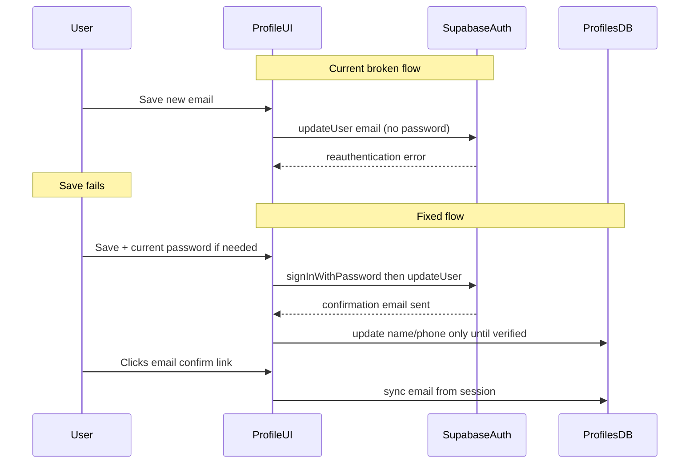

# Fix profile email save error

## Root cause analysis

Email changes are handled in `[src/components/user/UserProfile.tsx](src/components/user/UserProfile.tsx)`:

```56:74:src/components/user/UserProfile.tsx
  const handleSave = async () => {
    ...
    if (emailChanged && profile.email) {
      const { error: authError } = await supabase.auth.updateUser({ email: profile.email });
      if (authError) { toast.error(authError.message); ... }
    }
    const { error: profileError } = await supabase.from("profiles").update({
      ...(emailChanged ? { email: profile.email } : {}),
    })
```

Likely failure modes on project `anjmawtmkbjneplprinv`:


| Issue                         | Why it breaks                                                                                                                              |
| ----------------------------- | ------------------------------------------------------------------------------------------------------------------------------------------ |
| **No reauthentication**       | Email/password users often hit `Email change requires reauthentication` when Supabase secure settings are enabled                          |
| **No validation / normalize** | Raw input (spaces, casing) can trigger `Unable to validate email address`                                                                  |
| **Auth vs profile mismatch**  | Form loads `profiles.email` only; mobile users may have optional email in profile but **no** `auth.users.email`, causing confusing updates |
| **Premature profile write**   | `profiles.email` updates even when Auth only queued confirmation; user sees error or stale state                                           |
| **Missing redirect**          | `updateUser({ email })` should pass `emailRedirectTo` (same as signup in `[src/lib/authEmail.ts](src/lib/authEmail.ts)`)                   |





---

## 1. Auth helper: `updateUserEmail`

**File:** `[src/lib/authEmail.ts](src/lib/authEmail.ts)`

Add:

- `requestEmailChange(newEmail: string, currentPassword?: string)`:
  - `normalizeEmail` + `isValidEmailInput` (from `[src/lib/otpAuth.ts](src/lib/otpAuth.ts)`)
  - If `currentPassword` provided: `signInWithPassword` with **current** auth email first
  - Then `supabase.auth.updateUser({ email }, { emailRedirectTo: getAuthRedirectUrl() })`
  - Map errors to user-friendly messages (reauth, already registered, invalid email)

Add `hasEmailPasswordIdentity(user)` helper: true when `user.email` exists and user signed up with email (check `user.app_metadata.providers` or identities include `email`).

---

## 2. UserProfile save flow

**File:** `[src/components/user/UserProfile.tsx](src/components/user/UserProfile.tsx)`

**Load email from auth first:**

```typescript
const authEmail = user?.email ?? "";
const profileEmail = profileRes.data.email ?? "";
setProfile({ ..., email: authEmail || profileEmail });
originalEmail.current = authEmail || profileEmail;
```

**On save when email changed:**

1. Validate non-empty + `isValidEmailInput`
2. If normalized new email equals original → skip auth call
3. If user has email/password identity → open **Confirm password** dialog (reuse `Dialog` from UI kit); on submit call `requestEmailChange(newEmail, password)`
4. If phone-only (no auth email) → call `requestEmailChange(newEmail)` without password
5. On auth success → toast info about confirmation email; **do not** write `profiles.email` yet; keep showing pending note
6. On auth failure → toast error; **do not** update profile row

**Profile update** — always save `full_name` and `phone`; only include `email` in the update when email did **not** change (or after verification — see step 3).

---

## 3. Sync email after confirmation

**File:** `[src/pages/AuthCallback.tsx](src/pages/AuthCallback.tsx)`

After session is established (non-recovery, non-registration path), if `session.user.email` differs from `profiles.email`, update profile:

```typescript
await supabase.from("profiles").update({ email: session.user.email }).eq("user_id", session.user.id);
```

Then `toast.success("Email updated successfully.")` and continue normal redirect.

This covers users who confirm the email-change link.

---

## 4. UX polish

- Keep existing info text: confirmation email will be sent
- After requesting change, show inline **“Verification pending”** and revert the input to `originalEmail` until confirmed (optional: show new email as muted “pending: [user@new.com](mailto:user@new.com)”)
- Disable Save while password dialog is open / saving

---

## 5. Supabase Dashboard (manual, if phone users still fail)

If mobile-only users cannot add email and error mentions secure email change / missing old email:

- **Authentication → Providers → Email** → consider disabling **Secure email change** (only sends confirm to new address), **or** ensure phone users use “add email” without old-address confirmation.

Document this in README auth section if needed.

---

## Test plan

1. **Email/password user:** change email → password dialog → save → confirmation toast; profile DB email unchanged until link clicked → callback syncs email
2. **No email change:** save name/phone only → success, no auth call
3. **Invalid email:** client validation error, no API call
4. **Duplicate email:** friendly error from mapped auth message
5. **Phone-only user:** add email without password dialog → confirmation sent (or dashboard note if secure change blocks)

## Files touched


| File                                                                         | Change                                                  |
| ---------------------------------------------------------------------------- | ------------------------------------------------------- |
| `[src/lib/authEmail.ts](src/lib/authEmail.ts)`                               | `requestEmailChange`, identity helper, error mapping    |
| `[src/components/user/UserProfile.tsx](src/components/user/UserProfile.tsx)` | Auth-first email load, password dialog, fixed save flow |
| `[src/pages/AuthCallback.tsx](src/pages/AuthCallback.tsx)`                   | Sync `profiles.email` after email confirmation          |


